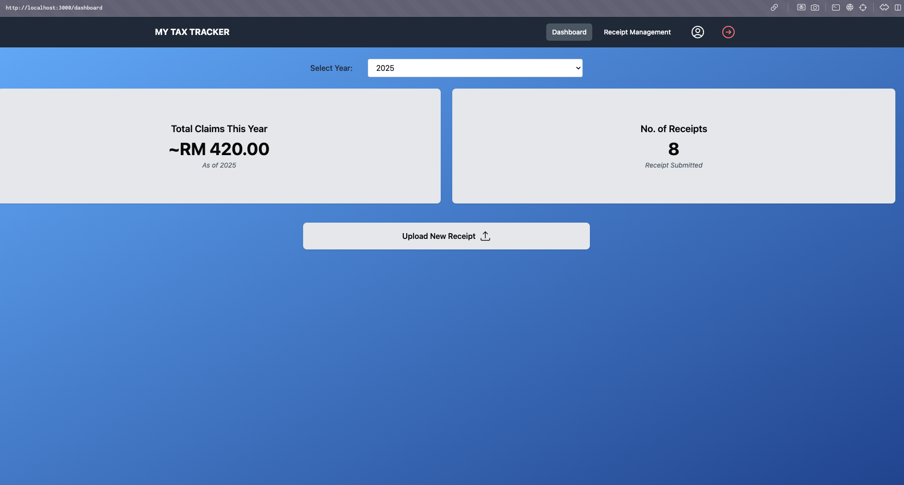
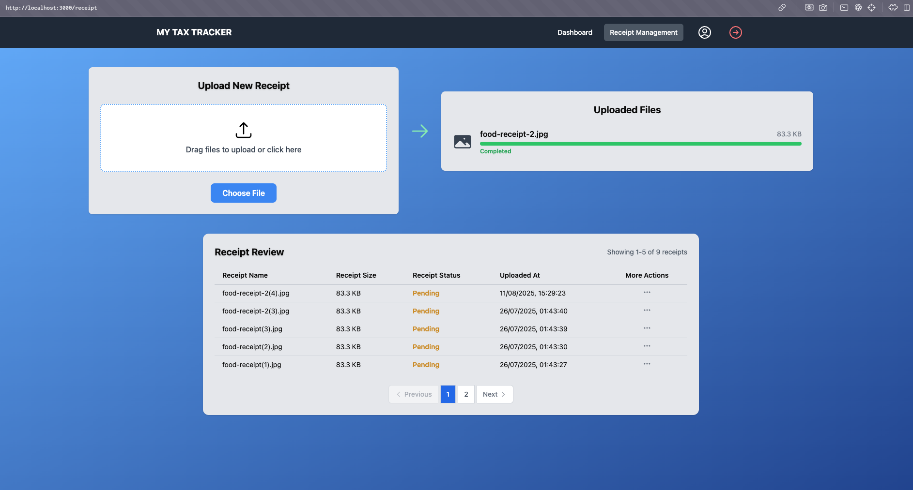

# My Tax Tracker - FullStack Application

A comprehensive fullstack malaysian tax tracking application built with **FastAPI (Python)** backend and **React** frontend, featuring AWS Cognito authentication, DynamoDB storage, and S3 file management.

## Features

- **User Authentication**: Secure login/logout with AWS Cognito
- **Receipt Management**: Upload, store, and organize tax receipts
- **OCR Processing**: Extract text from receipt images using AWS Textract
- **Responsive UI**: Modern, mobile-friendly interface built with Tailwind CSS
- **RESTful API**: Well-documented FastAPI backend with automatic documentation
- **Cloud-Native**: Built for AWS with Docker containerization

## 🛠️ Tech Stack

### Backend
- **FastAPI** - Modern, fast web framework for building APIs
- **Python 3.11** - Latest stable Python version
- **AWS Cognito** - User authentication and management
- **DynamoDB** - NoSQL database for data storage
- **S3** - File storage for receipt images
- **AWS Textract** - OCR processing for receipts
- **JWT** - Token-based authentication

### Frontend
- **React 19** - Latest React with modern hooks
- **Tailwind CSS** - Utility-first CSS framework

## 📋 Prerequisites

Before running this application, ensure you have:

- **Docker** installed on your system
  - [Docker Desktop](https://www.docker.com/products/docker-desktop/) for Windows/Mac
  - [Docker Engine](https://docs.docker.com/engine/install/) for Linux
- **Git** for cloning the repository
- **AWS Account** with appropriate permissions (for production use)

## 🚀 Quick Start Guide

### Step 1: Clone the Repository
```bash
git clone <your-repository-url>
cd my-tax-tracker
```

### Step 2: Set Up Environment Variables
1. Copy the environment template:
   ```bash
   cp .env.example .env
   ```

2. Edit `.env` file with your AWS credentials and configuration:
   ```bash
   # Required: AWS Cognito Configuration
   CLIENT_SECRET=your_cognito_client_secret
   CLIENT_ID=your_cognito_client_id
   COGNITO_USER_POOL_ID=your_user_pool_id
   
   # Required: AWS Credentials
   AWS_ACCESS_KEY_ID=your_access_key
   AWS_SECRET_ACCESS_KEY=your_secret_key
   
   # Required: DynamoDB Tables
   RECEIPT_TABLE=your_receipt_table_name
   BLACKLIST_TOKEN_TABLE=your_blacklist_table_name
   
   # Required: S3 Bucket
   S3_BUCKET=your_s3_bucket_name
   
   # Required: Frontend Configuration
   VITE_API_LOGIN_URL=http://localhost:8000/auth/login
   VITE_API_LOGOUT_URL=http://localhost:8000/auth/logout
   VITE_API_BASE_URL=http://localhost:8000
   
   # Required: Backend Configuration
   REDIRECT_URI=http://localhost:3000/
   ALLOW_ORIGINS=http://localhost:3000,http://localhost:8000
   ```

### Step 3: Make Scripts Executable
```bash
# Make both scripts executable
chmod +x start.sh
chmod +x test-setup.sh
```

### Step 4: Start the Application
```bash
# Run the start script (this will start everything and run tests)
./start.sh
```

### Step 5: Access the Application
- **Frontend**: http://localhost:3000
- **Backend API**: http://localhost:8000
- **API Documentation**: http://localhost:8000/docs
- **Health Check**: http://localhost:8000/health

## 🔧 Alternative Startup Methods

### Option 1: Using Docker Compose Directly
```bash
# Build and start all services
docker-compose up --build

# Or run in detached mode
docker-compose up --build -d
```

### Option 2: Using Individual Docker Commands
```bash
# Backend only
cd backend-app/backend
docker build -t tax-tracker-backend .
docker run -p 8000:8000 --env-file ../../.env tax-tracker-backend

# Frontend only (in another terminal)
cd frontend-app/frontend/my-tax-tracker-fe
docker build -t tax-tracker-frontend .
docker run -p 3000:3000 --env-file ../../../.env tax-tracker-frontend
```

## 🧪 Testing the Application

### Automatic Testing (Recommended)
The `start.sh` script automatically runs all tests for you. If you want to run tests manually:

```bash
# Run tests manually
./test-setup.sh
```

### Manual Testing
```bash
# Check if containers are running
docker-compose ps

# View logs
docker-compose logs -f

# Test backend health
curl http://localhost:8000/health

# Test frontend
curl http://localhost:3000
```

## 🐛 Troubleshooting

#### Docker Build Issues
```bash
# Clean Docker cache
docker system prune -a

# Rebuild without cache
docker-compose build --no-cache
```

#### CORS Issues
If you're getting CORS errors:
1. Ensure `ALLOW_ORIGINS` includes `http://localhost:3000`
2. Check that the backend CORS middleware is properly configured
3. Restart containers after making CORS changes

#### AWS Credentials Issues
- Ensure your AWS credentials have the necessary permissions
- Verify the region matches your AWS resources
- Check that DynamoDB tables and S3 buckets exist

### Logs and Debugging
```bash
# View real-time logs
docker-compose logs -f

# View specific service logs
docker-compose logs -f backend
docker-compose logs -f frontend

# Access container shell for debugging
docker-compose exec backend bash
docker-compose exec frontend sh
```

## 📁 Project Structure

```
my-tax-tracker/
├── backend-app/
│   └── backend/
│       ├── src/
│       │   ├── models/          # Database models
│       │   ├── routers/         # API endpoints
│       │   ├── config.py        # Configuration & AWS setup
│       │   └── helpers.py       # Utility functions
│       ├── main.py              # FastAPI application
│       ├── requirements.txt     # Python dependencies
│       └── Dockerfile           # Backend container
├── frontend-app/
│   └── frontend/
│       └── my-tax-tracker-fe/
│           ├── src/
│           │   ├── components/   # React components
│           │   ├── pages/        # Page components
│           │   └── customprocess/ # Authentication & utilities
│           ├── package.json      # Node.js dependencies
│           └── Dockerfile        # Frontend container
├── docker-compose.yml           # Service orchestration
├── .env                         # Environment variables (create from .env.example)
├── start.sh                     # Startup script
├── test-setup.sh                # Testing script
└── README.md                    # This file
```

## 🎯 Key Changes Made:

1. **Added chmod instructions** - Step 3 now includes making scripts executable
2. **Simplified startup** - Focus on the `./start.sh` script as the main method
3. **Removed complex local development** - Kept only the essential Docker methods
4. **Streamlined testing** - Emphasized automatic testing via the start script
5. **Clearer flow** - Step-by-step process is now much easier to follow

## 🚀 Now the flow is super simple:

1. **Clone repo**
2. **Set up .env**
3. **Make scripts executable**: `chmod +x *.sh`
4. **Run `./start.sh`**
5. **Access your app**

Much cleaner and easier to follow! 🎉

## 🎯 How to Use This Setup

1. **Clone your repository**
2. **Copy `.env.example` to `.env`** and fill in the required AWS credentials
3. **Make scripts executable**: `chmod +x *.sh`
4. **Run `./start.sh`** to start everything
5. **Visit http://localhost:3000** to see your app running
6. **Check http://localhost:8000/docs** to see your API documentation

### Project Initial Objectives:

✅ **Full-Stack Development**: Python backend + React frontend  
✅ **DevOps Skills**: Docker, Docker Compose, containerization  
✅ **Cloud Integration**: AWS services (Cognito, DynamoDB, S3)  
✅ **Documentation**: Professional README with clear instructions  
✅ **Testing**: Automated setup verification  
✅ **Production Ready**: Proper environment management and security  

## 🚀 For Production Deployment:

1. **AWS ECS/Fargate** for container orchestration
2. **Application Load Balancer** for traffic distribution
3. **CloudFront** for frontend CDN
4. **RDS/ElastiCache** for additional data storage needs
5. **CloudWatch** for monitoring and logging

## 📚 Resources

- [FastAPI Documentation](https://fastapi.tiangolo.com/)
- [React Documentation](https://react.dev/)
- [Docker Documentation](https://docs.docker.com/)
- [AWS Cognito Documentation](https://docs.aws.amazon.com/cognito/)

## 📱 MY Tax Tracker Application 

### Login & Authentication

*AWS Cognito authentication flow*


*Application login interface*

### Dashboard & Navigation

*Main dashboard with navigation*

### User Management

*User profile and settings*

### Receipt Management

*Receipt upload and management interface*

---
